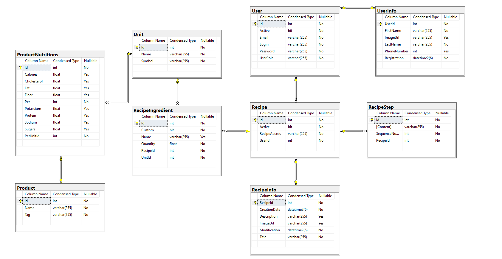

# FoodHub

Application allows users to add their own recipes and browse recipes published by other users. It features a user-friendly interface, making it easy to manage and explore a variety of culinary creations.

## Table of Contents

- [Features](#features)
- [Technologies](#technologies)
- [ERD Diagram](#erd-diagram)
- [Authors](#authors)
- [Contact](#contact)
- [Licence](#license)

## Features

- **User Authentication**: Secure login and registration for users.
- **Recipe Management**: Users can create and display their own recipes.
- **Browse Recipes**: Users can browse and search recipes published by others.
- **Profile Management**: Users can update their profile information and view their published recipes.
- **Admin Panel**: Admin users have access to additional functionalities such as displaying available 'Units'.

## Technologies
- Java
- Spring Boot ( + Security )
- JavaScript
- React
- SQL Server
- HTML
- CSS

## ERD Diagram

## Authors

-   Damian Barwiołek

## Contact

If you have any questions, contact me via email: damian.barwiolek@student.pk.edu.pl

## License

[MIT](https://choosealicense.com/licenses/mit/)